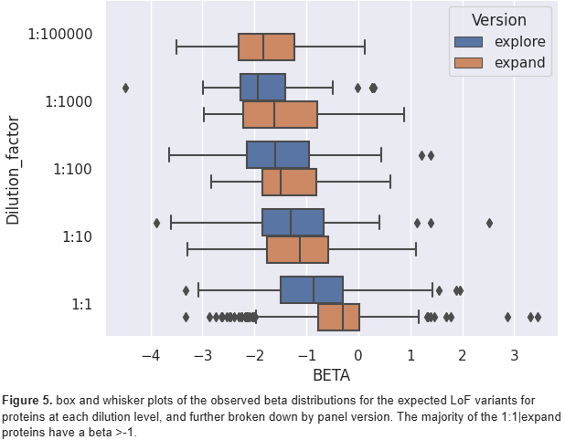

# MultiOmicsProject

## Introduction

Predicted loss of function variants (pLoFs) refer to mutations within protein coding sequences that computational predictions suggest will result in the premature termination of protein synthesis, triggering Nonsense Mediated Decay (NMD). These pLoFs are classified into stop-gained, frameshift, splice-acceptor, and splice-donor variants. Due to their substantial predicted impact on protein levels, such mutations are typically infrequent and may be prone to technical artifacts [1].
Validating pLoFs is a meticulous process involving both manual curation and functional validation. The assessment of protein levels offers a systematic approach to evaluate the functionality of pLoFs. The UK Biobank project, facilitated by the Pharma Proteomics Consortium, has recently released exome sequence and proteomics data for 49,736 individuals, encompassing 2,923 protein abundances using the Olink panel [2]. In this publication, Dhindsa et al. outline the association of any point mutation with a minor allele count (MAC) greater than 6.  

In the research presented below, a statistical genetics analysis was conducted encompassing all pLOFs, including those with MAC less than 6, within the 2,923 genes coding for proteins in the Olink panel. Following this analysis, a comparison was made with results from software designed for pLoF categorization: the Loss-Of-Function Transcript Effect Estimator, aka LOFTEE [3]. Additionally, an exploration of potential error modes not identified by this software was undertaken.

## Methods

### Datasets

Genetic variation data from 469,835 exome-sequenced UKB participants were provided in PLINK format, including binary biallelic genotype tables (.bed files) with accompanying variant map (.bim) and sample information (.fam) files for each chromosome, encompassing >21.5 million variants in total. PLINK 2.0 is a genetic analysis tool used for managing large position-based single nucleotide polymorphism (SNP)-like datasets, supporting wide-ranging functionalities from performing basic operations such as filtering and summary statistics to statistical genetics operations like linkage-disequilibrium (LD) calculation and population stratification detection [4]. For details regarding the exome sequencing, alignment of reads to the GRCh38 genome reference, and variant calling refer to the UK BioBank showcase [https://biobank.ndph.ox.ac.uk/showcase/label.cgi?id=170 ].  

Olink normalized protein expression (NPX) abundances for 2,923 proteins obtained from a subset of 53,017 UKB participants were provided. For details, refer to the UK BioBank showcase [https://biobank.ndph.ox.ac.uk/showcase/label.cgi?id=1839].The data had previously been converted to z-scores by rank-based inverse normal transformation (INT) to achieve normally distributed profiles [5]. These rank-normalized profiles for each subject were provided in a comma-separated plain-text file.  

Proteomics covariate data (e.g. age, sex, batch, time from blood sampling to measurement) for each of the 53,017 subjects was provided in Hail MatrixTable format. Hail is a Python library that allows for efficient storage and querying of large multidimensional data tables with functionality designed specifically for processing genetic data [6].

### Exome-Wide Association Study (ExWAS)  

The machine learning-based C++ program REGENIE was used to perform the exome-wide association study (ExWAS). REGENIE was chosen because it is computationally efficient while still preserving statistical accuracy. It allows for parallel analysis of multiple phenotypes simultaneously and only requires small segments of the genotype matrix to be loaded into memory at one time. The support for parallel processing makes it ideal for use with a cloud cluster with many computing threads, enabling a genome-wide analysis of thousands of traits to be completed in a matter of days [7].

REGENIE functions in a two-step procedure. In the first step, a whole genome regression model for each trait is fit to a subset of the total available genetic markers, and 23 genetic predictions for each phenotype are then constructed using a leave-one-chromosome-out (LOCO) approach [7]. For this step of the analysis, PLINK 2.0 was used to filter/prune down the original 21.5 million variants to a set of 12,900 high-quality SNPs meeting the following criteria: genotyping rate ≥90%, minor allele frequency (MAF) ≥5%, and, in order to prune for linkage-disequilibrium (LD), a squared correlation coefficient (r2) ≤ 0.05 between variant pairs in a 1000 kilobase (kb) window. 1807 variants were removed by the missing genotype rate filter, 21.4 million variants (99.5%) were removed by the MAF filter, and 83,248 of the remaining 96,148 (86.5%) were removed by the LD pruning, leaving a set of 12,900 high quality variants for training the whole genome regression models.

In the second step, REGENIE tests a larger set of variants for association with each trait. Covariates are regressed out of the phenotypes and genotypes, the LOCO predictions from the first step are subtracted from the traits, and then linear regression is used to test association of the residualized phenotype with the genetic variant [7]. This test uses the additive model, which assumes each allele contributes independently and equally to the overall phenotype, so two copies of the minor allele is expected to have twice the effect of one, and one copy of the minor allele (heterozygous) is expected to have an intermediate phenotype between that of the two homozygotes [8].

For this second step, genotype data was removed for the 39 subjects that withdrew from the study. A subset of 1.8 million (1,773,777) variants in the exons for the 2,923 Olink proteins were used for the association tests. In order to determine this subset, the provided whole genome variant annotations were filtered for only those annotated with gene symbols for the 2,923 Olink proteins, and then PLINK 2.0 was used to extract the genotypic data for these variants for each chromosome. Additionally, a minimum minor allele count (minMAC) of 1 was specified in this step in order to test associations for all variants (default minMAC = 5). Due to technical limitations and time/cost constraints, only cis-coding-sequence (cis-CDS) associations were tested for all but chr1, chr2, and chr22 (i.e. association for each variant was tested for only the abundances of protein encoded by the gene the variant is located within).

REGENIE also allows for correcting for covariates such as batch effects, age, and sex by incorporating a list of covariates into the analysis and regressing them out of phenotypes and genotypes before fitting the model [7]. The following variables were extracted from the provided covariates dataset using the Hail Python library and included in the analysis: batch, time between blood sampling and measurement, age, sex, age*sex, age*age, age*age*sex, and the first 10 genetic principal components (PCs).

The performance of the ExWAS was briefly assessed by constructing Manhattan plots and quantile-quantile (QQ) plots of the resultant genomic association -log10(p-values) for a random selection of proteins from chr1 and chr22. Manhattan plots display these results with respect to their genomic positions. QQ plots show the distribution of expected p-values under the null model of no significance versus the observed values. Both of these plots allow one to visually assess for an inflated false positive / type I error rate that would indicate the test is not well calibrated. For the Manhattan plot, there are only expected to be a few true strongly significant signals, along with some possibly inflated values around the same loci due to LD. Similarly, for the QQ plot, one would expect deviation from the null at only the highly significant end of the plot for true causal effects. Inflated signals across the entire genome or inflation of the observed values across the distribution is indicative of spurious associations due to an underlying problem [9,10]. The plots were constructed using all variants and also using only those variants with a minor allele count (MAC) > 5 in order to assess whether the variants with low counts (≤5) were misbehaving. The plots were constructed using Python with the NumPy, pandas, Matplotlib, and Seaborn libraries. 

### Quality Control (QC)

For the purposes of this study, variants found to have an estimated effect size (beta) < -1 in the ExWAS are considered to be loss of function variants (LoFs). Analysis was performed to assess for underlying relationships between aspects of the protein assays and the observed beta values / LoF classifications that could potentially confound the results. Observed beta and LoF classification for expected LoF variants (annotated as “HIGH” impact by Ensembl Variant Effect Predictor) were evaluated against variables including proteomics panel version and type, and protein dilution factor. The proteins were assayed using two different Olink panel versions: explore (1385 proteins) and expand (1306 proteins). The proteins were also assayed on four different panel types for each version: cardiometabolic (370|360 proteins for explore|expand respectively), neurology (370|373 proteins), inflammation (368|368 proteins), and oncology (372|369 proteins). Proteins were measured using 5 different dilution factors: 1:1 (1761 proteins), 1:10 (495 proteins), 1:100 (249 proteins), 1:1000 (117 proteins), and 1:100000 (69 proteins). For each variable, beta distributions for the variant-protein associations were compared between each group. Additionally, LoF classification logistic regression models were fit to each variable, and the coefficients were assessed. Results were also examined on a gene level using the mean beta for the variants in that gene, and protein assay missingness rates were also evaluated. Proteins with problematic results were removed from further analyses. Analysis was performed using Python with the NumPy, pandas, Matplotlib, Seaborn, SciPy, and scikit-learn libraries.

### Loss-of-Function (LoF) Analysis

After performing QC to remove proteins for suspected technical issues, observed results for the remaining pLoFs were evaluated for trends based on minor allele frequency and predicted consequence. Additionally, the pLoF annotations generated by the Loss-Of-Function Transcript Effect Estimator (LOFTEE) were evaluated against the observed ExWAS results. LOFTEE integrates with the Ensembl Variant Effect Predictor (VEP) to assess whether a pLoF is likely to cause a true LoF effect by implementing a set of filters that consider factors such as the location of the variant within the gene and the potential for rescue by alternative splicing, with the goal of distinguishing genuine LoF mutations from benign variants, and thereby improving the accuracy of genetic variant interpretation in genomic studies. LOFTEE assesses the following types of protein-truncating variants: stop-gained, frameshift, and splice site disrupting. Variants that pass these filters are labeled as “HC” for high confidence, while variants removed by the filters are labeled “LC” for low confidence [3].

## Results

### ExWAS Performance

Based on diagnostic plots created for a random selection of proteins encoded by genes on chr1 and chr22, the ExWAS appears quite successful with plenty of power to detect true associations. For the majority of the diagnostic QQ-plots, the observed results follow the null distribution closely up until the highly significant end, as shown for ATP5IF1 in Fig. 1, indicating that there is not an inflated type I error rate. In general, the p-values for variants with MAC < 6 appear to be only slightly inflated, as shown in Fig. 2 for CEP85, and not so much as to create false positive associations above a significance threshold of 5 x 10-8.

### Protein Assay QC

In the analysis of protein assay effects, it was discovered that the proteins assayed with the expand version of the Olink panel had much higher missingness rates than those assayed with the explore version (mean 17.1% vs. mean 3.4%, respectively), as shown in Fig. 3. The two proteins with >25% missingness, CST1 (27%) and PCOLCE (64%), were removed from further analyses.

Additionally, it was found that both dilution factor and panel version had a significant influence on true LoF status for the expected LoF variants, as illustrated in Fig. 4 and 5. The 1:1 dilution group was less sensitive to detect true LoF variant effects, and this was especially true in the expand panel version where missingness was also higher. When averaging the pLoF effects for each gene, only 16% of the genes encoding proteins in the 1:1|expand dilution|version group had mean beta < -1 (LoF), compared to 43% LoF for the 1:1|explore group, as shown in Fig. 4d. Therefore, the 978 proteins in the 1:1|expand group were removed from further analyses.

Finally, 33 proteins were found to have mean beta >1 at the gene level. The variants in this analysis were expected to cause loss of function based on the predicted sequence mutation consequences, yet the observed beta is strongly positive indicating gain of function. Due to this misbehavior, these proteins were also removed from further analyses.

### LoF Analysis

Out of the different pLoF consequences (stop_gained, frameshift_variant, splice_donor_variant, splice_acceptor_variant, start_lost, and stop_lost), the predicted stop_lost variants were found to have a mean beta of -0.6, which is significantly higher than the other types which all had a mean beta < -1, as shown in Fig. 6. Additionally, stop_gained and frameshift variants have slightly more negative mean betas than the other pLoFs (-1.3 for both vs. -1.1 for the others), with ~60% of these variants being LoFs vs. 50-55% for start_lost and splice variants (and only ~40% for start_lost). A LoF classification logistic regression (LR) model fit to the data with consequence class as the independent variable results in 58.2% accuracy and an area under the ROC curve (AUC) of 0.527.

Allele frequency effects were evaluated by assigning variants to 7 different frequency groups: singleton (9974 variants), doubleton (2242 variants), >doubleton to <0.01% frequency (2445 variants), 0.01-0.1% (799 variants), 0.1-1% (134 variants), 1-10% (34 variants), and >10% (12 variants). It was found that beta tends to decrease with decreasing allele frequencies, and this holds true even for singletons and doubletons, as shown in Fig. 7. A LoF classification LR model fit to the data with frequency bucket as the independent variable results in 58.4% accuracy and an AUC of 0.515. A LR classifier combining both predicted consequence and allele frequency bucket improves the results to 58.6% classification accuracy and an AUC of 0.537.

### LOFTEE Evaluation

93.2% (14579) of the LOFTEE-assessed variants passed all of the filters and were thus labeled high confidence. The remaining 6.8% (1061) failed to meet at least one filter criteria and as such were labeled low confidence. As shown in Fig. 8, despite not using frequency information [3], LOFTEE removes larger proportions from common variants, and a very low proportion from rare variants, which are more likely to be true LoFs, indicating that LOFTEE is successfully removing false positive pLoFs.

However, there is only a small difference in mean beta between the HC and LC groups (-1.26 vs. -0.87 for a delta of 0.39) as shown in Fig. 9a-b, meaning that LOFTEE is still removing many (~50%) true LoFs and missing many false positive pLoFs, which make up ~40% of the high confidence pLoFs. As seen in Fig. 9c-d, moderate enrichment in true LoFs in the HC group is only seen for variants with MAF ≥ 0.1%, which make up <10% of the total pLoF variants. As such, LOFTEE confidence annotation only appears to be a weak predictor of true LoFs; a LoF classification LR model fit to the data with LOFTEE confidence class as the independent variable results in 58.4% accuracy and AUC of 0.513. A LR classifier combining all of the variables explored thus far (predicted consequence, allele frequency bucket, and LOFTEE confidence) improves classification accuracy to 58.9% with an AUC of 0.546.

When further breaking down the low confidence pLoFs by the type of filter criteria they failed to meet, it was discovered that the vast majority (90.0%) of the LC pLoFs were removed due to the END_TRUNC filter. This filter removes predicted stop-gained and frameshift variants that are located near the end of the transcript [3], and it filtered out 8.2% (541) of predicted frameshift variants and 7.7% (414) of predicted stop-gained variants. However, as shown in Fig. 10a-b, this filter did not perform well, removing slightly more true LoFs than false positives. It performed equally poorly for both the predicted frameshift and predicted stop-gained variants (Fig. 10c). The performance of this filter appears to have a dependence on the number of exons in the gene, as shown in Fig. 10d, with the filter generally removing more false positives than true LoFs when the number of exons is greater than 7.

As for the remaining filter types, the 5UTR_SPLICE (7.6% of LC), 3UTR_SPLICE (1.5%), and GC_TO_GT_DONOR (0.6%) perform fairly well, with ~70% or more of the removed pLoFs having a beta > -1, though the sample size for the latter two filters is small (<20 variants). These filters affect splice-site variants, with the 5UTR_SPLICE and 3UTR_SPLICE filters removing variants that only affect untranslated region (UTR) splicing, and the GC_TO_GT_DONOR filter removing splice donor variants that are not expected to impact a donor site [3].

In addition to the confidence filters, LOFTEE also annotates variants meeting certain criteria with cautionary warning flags. These annotations were also evaluated for relationships with true LoF classification. 2,901 of the 15,640 LOFTEE-assessed pLoFs were flagged (18.5%), mostly with the PHYLOCSF_WEAK flag (2719; 93.7%). This flag applies to frameshift and stop-gained variants in exons that do not have the evolutionary signature characteristic of a coding region based on Phylogenetic Codon Substitution Frequencies (PhyloCSF) score [3, 11]. Compared to unflagged variants, pLoFs with the PHYLOCSF_WEAK flag are slightly less likely to be true LoFs, as shown in Fig 11a. This holds true for LOFTEE low confidence pLoFs, especially for stop-gained variants, as out of the 180 LC stop-gained variants with the PHYLOCSF_WEAK flag, only 45% are true LoFs, compared to 56% of the 225 unflagged LC stop-gained variants (Fig 11b). pLoFs annotated with the NAGNAG_SITE, NON_CAN_SPLICE or PHYLOCSF_UNLIKELY_ORF flags are also more likely to be false positives than unflagged variants; this applies for both HC and LC pLoFs, but the effect for NAGNAG_SITE and NON_CAN_SPLICE flags is much stronger for LC variants, as seen in Fig. 11, though the sample sizes are small (5 & 9 variants, respectively).

It was also discovered that pLoFs with the SINGLE_EXON flag (47 total) – for stop-gained and frameshift variants in genes with only a single exon [3] – are highly likely to be true LoFs (81% LoFs) regardless of LOFTEE confidence annotation. This is especially true for the frameshift variants, where 89.3% of the 28 variants are LoFs (versus 68.4% of 19 stop-gained). These variants also appear to have a relationship with allele frequency, with the number of variants decreasing but the proportion of LoFs increasing with increasing allele frequency as shown in the table below:

## Discussion

The study identified key findings regarding the impact of predicted loss-of-function (pLoF) variants on protein levels, utilizing the UK Biobank exome sequence and proteomics data. The analysis revealed significant effects of dilution factor and panel version on LoF classification, necessitating the removal of affected proteins from further analysis. This highlights the need for careful quality control and consideration of technical variables in proteomics studies.
The study also found that the inverse relationship between allele frequency and deleterious effect holds true even for variants with MAC < 6, as the singleton and doubleton pLoFs exhibited the lowest mean effect sizes.
The LOFTEE tool's performance was also evaluated, revealing that it successfully filtered out false positive pLoFs, though it also removed approximately 50% true LoFs. This suggests that while LOFTEE's high-confidence annotations are useful, they are not entirely reliable predictors of true loss-of-function effects.

In conclusion, the findings underscore the complex relationship between genetic variants and protein levels, and the importance of robust quality control in genomic studies. Future research should focus on refining predictive tools and addressing the technical challenges identified in this study.

## References

1. MacArthur, D. G., Balasubramanian, S., Frankish, A., Huang, N., Morris, J., Walter, K., Jostins, L., Habegger, L., Pickrell, J. K., Montgomery, S. B., Albers, C. A., Zhang, Z. D., Conrad, D. F., Lunter, G., Zheng, H., Ayub, Q., DePristo, M. A., Banks, E., Hu, M., … Tyler-Smith, C. (2012). A systematic survey of loss-of-function variants in human protein-coding genes. Science, 335(6070), 823–828. https://doi.org/10.1126/science.1215040

2. Dhindsa, R. S., Burren, O. S., Sun, B. B., Prins, B. P., Matelska, D., Wheeler, E., Mitchell, J., Oerton, E., Hristova, V. A., Smith, K. R., Carss, K., Wasilewski, S., Harper, A. R., Paul, D. S., Fabre, M. A., Runz, H., Viollet, C., Challis, B., Platt, A., … Petrovski, S. (2023). Rare variant associations with plasma protein levels in the UK Biobank. Nature, 622(7982), 339–347. https://doi.org/10.1038/s41586-023-06547-x

3. Karczewski, K. J., Francioli, L. C., Tiao, G., Cummings, B. B., Alföldi, J., Wang, Q., Collins, R. L., Laricchia, K. M., Ganna, A., Birnbaum, D. P., Gauthier, L. D., Brand, H., Solomonson, M., Watts, N. A., Rhodes, D., Singer-Berk, M., England, E. M., Seaby, E. G., Kosmicki, J. A., … MacArthur, D. G. (2020). The mutational constraint spectrum quantified from variation in 141,456 humans. Nature, 581(7809), 434–443. https://doi.org/10.1038/s41586-020-2308-7

4. Chang, C. C., Chow, C. C., Tellier, L. C., Vattikuti, S., Purcell, S. M., & Lee, J. J. (2015). Second-generation PLINK: Rising to the challenge of larger and richer datasets. GigaScience, 4(1). https://doi.org/10.1186/s13742-015-0047-8

5. Chien, L.-C. (2020). A rank-based normalization method with the fully adjusted full-stage procedure in Genetic Association Studies. PLOS ONE, 15(6). https://doi.org/10.1371/journal.pone.0233847 

6. Hail Team. Hail 0.2.128-eead8100a1c1. https://github.com/hail-is/hail/releases/tag/0.2.128.

7. Mbatchou, J., Barnard, L., Backman, J., Marcketta, A., Kosmicki, J. A., Ziyatdinov, A., Benner, C., O’Dushlaine, C., Barber, M., Boutkov, B., Habegger, L., Ferreira, M., Baras, A., Reid, J., Abecasis, G., Maxwell, E., & Marchini, J. (2021). Computationally efficient whole-genome regression for quantitative and binary traits. Nature Genetics, 53(7), 1097–1103. https://doi.org/10.1038/s41588-021-00870-7

8. Bush, W. S., & Moore, J. H. (2012). Chapter 11: Genome-Wide Association Studies. PLoS Computational Biology, 8(12). https://doi.org/10.1371/journal.pcbi.1002822
 
9. McCarthy, M. I., Abecasis, G. R., Cardon, L. R., Goldstein, D. B., Little, J., Ioannidis, J. P., & Hirschhorn, J. N. (2008). Genome-wide association studies for complex traits: Consensus, uncertainty and Challenges. Nature Reviews Genetics, 9(5), 356–369. https://doi.org/10.1038/nrg2344

10. Uffelmann, E., Huang, Q. Q., Munung, N. S., de Vries, J., Okada, Y., Martin, A. R., Martin, H. C., Lappalainen, T., & Posthuma, D. (2021). Genome-wide association studies. Nature Reviews Methods Primers, 1(1). https://doi.org/10.1038/s43586-021-00056-9
Lin, M. F., Jungreis, I., & Kellis, M. (2011). PhyloCSF: A comparative genomics method to distinguish protein coding and non-coding regions. Bioinformatics, 27(13), i275–i282. https://doi.org/10.1093/bioinformatics/btr209
